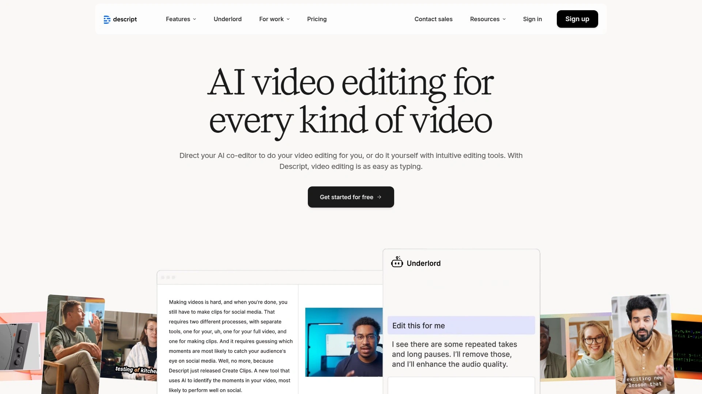

# 2025年排名前15的AI视频生成工具汇总(最新整理)

还在为制作视频发愁吗?传统视频制作流程太复杂,拍摄、剪辑、配音每一步都费时费力。好消息是,AI视频生成技术已经成熟到可以让普通人几分钟内完成专业级视频。无论你是做营销推广、企业培训还是社交媒体内容,这些工具都能帮你把文字脚本直接变成带AI数字人、配音和字幕的完整视频。下面整理了15个目前最值得关注的平台,覆盖从简单的文字转视频到复杂的虚拟人定制,总有一款适合你的需求。

***

## **[Elai.io](https://elai.io)**

全能型AI视频平台,从文本到成片一站搞定

Elai是目前市场上功能最全面的AI视频生成器之一,特别适合需要批量制作培训视频和营销内容的企业。平台提供80多个数字人形象,支持75种以上语言和450多种AI配音。

核心能力包括语音克隆、PPT直接转视频、自动翻译和互动式视频制作。你可以用自己的声音创建定制数字人,也可以从模板库快速开始。对话功能允许在同一画面放置两个数字人进行对话,这在教学场景特别实用。

技术上支持1080p和4K分辨率输出,提供完整的视频编辑器包括转场动画。还集成了ChatGPT-4帮你生成脚本,整个工作流非常顺畅。适合L&D部门将大量文本材料转化为交互式视频内容。

## **[Synthesia](https://www.synthesia.io)**

企业级AI视频解决方案,60%的财富100强都在用

定位于高端企业市场的AI视频平台,在全球拥有超过250万用户。Synthesia的强项是制作公司内部沟通、培训和产品演示视频。

**数字人质量**:提供120多种语言和口音的逼真AI主播,支持创建个人专属数字分身。平台对数字人使用有严格审核机制,禁止未经授权的名人或政治人物克隆,确保合规性。

**应用场景**:主要服务企业培训、电子学习、市场营销和内部通讯领域。输入文本脚本、选择数字人和声音,AI会自动生成带口型同步的完整视频。

从2017年成立至今,已发展成估值10亿美元的独角兽公司,证明了其在B2B市场的领导地位。

## **[HeyGen](https://www.heygen.com)**

照片秒变会说话的数字人,表情动作最自然

HeyGen的核心竞争力在于其Avatar IV技术——能把一张静态照片转化成具有自然语音同步、面部表情和手势动作的完整视频。这是目前市场上最接近真人的数字人生成效果。

提供四种数字人创建方式:最新的Avatar IV照片转视频、Video Avatar视频录制生成、Photo Avatar单图生成,以及超过1000个现成的库存数字人。可以自定义表情、手势、服装、背景和动作以匹配任何风格。

**文本转视频流程**:输入脚本,系统自动生成完整视频(1080p或4K),包含配音、视觉元素和AI数字人。支持100多种语言的视频翻译功能,一键本地化你的内容。

特别适合制作产品讲解、销售演示、入职培训或YouTube内容。

## **[Pictory](https://pictory.ai)**

博客文章一键变视频,内容创作者的效率神器

Pictory专注于将长文本内容快速转化为短视频,特别适合自媒体和内容营销团队。只需粘贴文章或博客链接,AI会自动提取关键信息并生成视频脚本。

**智能剪辑能力**:可以把长视频自动剪成适合社交媒体的短片段。系统会识别精彩片段,添加字幕和背景音乐,自动调整为YouTube、TikTok或Instagram的最佳尺寸。

内置超过300万个来自Storyblocks的高质量视频片段和图片素材库,这个库单独订阅就要每月30美元。AI配音有2000多种自然语音可选,还支持语音克隆。

工作流程非常直观:上传脚本或视频链接→AI生成场景和高亮文本→选择模板和画幅比例→添加旁白和音乐→导出。

## **[Descript](https://www.descript.com)**

像编辑文档一样编辑视频,播客制作人的最爱

Descript的独特之处在于它的文档式编辑界面——转录你的视频后,直接编辑文字稿就能修剪视频,不需要学习复杂的时间轴操作。这种方式让完全没有视频编辑经验的人也能快速上手。

除了视频编辑,还能录制和制作播客。多轨编辑功能允许分层添加音频、视频和图形元素。

**AI助手Underlord**:内置的AI助手可以接受自然语言指令,比如"把这个视频改成15秒的TikTok版本并加字幕"或"添加章节标记"。自动移除口头禅、修复音频错误、生成字幕,甚至能用AI声音替换录音中的错误部分。

特别适合YouTube创作者、播客制作人和需要协作审核的营销团队。可以多人在线评论同一项目,用时间戳标注修改建议。

## **[InVideo AI](https://invideo.io)**

提示词生成完整电影,支持AI虚拟人和语音克隆

InVideo AI v3.0带来了突破性的动画风格视频生成能力,能创建从解说视频到完整AI电影的各类内容。只需输入文本提示或使用预设工作流,系统就能生成带脚本、媒体素材、配音和音效的完整视频。

**Express Avatar功能**:用录制的视频或YouTube链接创建你的AI数字分身,用于制作培训视频、产品讲解,完全跳过拍摄环节。语音克隆支持把内容转换成50多种全球主流语言。

**UGC和产品展示**:可以生成超逼真的用户证言视频、代言人片段、自拍风格UGC和亚马逊产品评测,使用真实的人类数字人而无需寄送产品或雇佣自由职业者。

编辑方式非常友好,用简单的文字指令就能修改场景、更换音乐、调整语调,不需要学习复杂的时间轴编辑。

## **[Colossyan Creator](https://www.colossyan.com)**

文档秒变培训视频,支持80种语言自动翻译

Colossyan专注于企业培训视频制作,可以直接上传PPT、PDF或Word文档,平台会基于内容自动生成视频草稿和脚本。这对需要快速更新培训材料的团队来说是巨大的时间节省。

提供600多种AI配音和口音,覆盖80多种语言的自动翻译。企业版用户还可以创建多语言变体,合并成一个视频让观众自选语言。

制作流程:开始新草稿或上传文档→编辑脚本→选择AI配音/数字人→设计场景并添加动画和媒体→预览生成→导出或分享。可以保留原始PPT幻灯片样式,也可以使用平台预制模板重新设计。

获得2025年UX设计奖,界面友好度得到专业认可。

## **[Fliki](https://fliki.ai)**

文本转视频速度最快,支持2000种逼真语音

Fliki的核心优势是极快的生成速度和庞大的语音库,提供80多种语言的2000多种逼真AI配音。特别适合需要大批量制作YouTube、Instagram和TikTok短视频的创作者。

**角色一致性**:在多个场景保持视觉风格统一,AI会自动匹配场景与文本内容。支持4K分辨率输出,并能创建对话式视频(最多两个数字人同屏)。

**语音克隆与数字人**:能克隆你的声音用于无脸视频制作,或创建定制数字人作为演示者。数字人具有同步口型、多种屏幕位置选择,适合讲解视频和教程。

导出格式灵活,支持MP4、MOV视频和MP3、WAV纯音频,适配多种平台和用途。可以直接从博客文章、脚本或网址转换成视频。

## **[Runway](https://runwayml.com)**

最先进的生成式AI,支持图像转视频和视频转视频

Runway的Gen-4模型代表了当前AI视频生成的最高水平,能确保多个镜头之间角色和场景的连贯性。网站月访问量达到1490万,增长势头强劲。

**三种生成模式**:图像转视频、文本转视频和视频转视频。可以上传参考图像或视频,然后用不同风格和方式重新渲染。

**精细化导演工具**:生成视频后,可以手动圈选画面中最多五个部分,为每个部分单独设置运动方向和效果。这种控制力度是其他工具难以匹敌的。

定价采用积分制:免费版提供125次性积分(相当于Gen-4 Turbo模型25秒素材);标准版月费12美元含625积分;专业版28美元含2250积分;无限版76美元可无限生成。也可在Canva Magic Studio中使用Runway功能。

## **[Lumen5](https://lumen5.com)**

博客转视频的经典工具,全球250万企业都在用

Lumen5是最早一批的AI视频生成平台,专注于将文字内容转化为社交媒体视频。输入博客链接或文本,AI会自动选择相关图片、视频片段和音乐来匹配内容。

**拖放式界面**:完全不需要视频编辑技能,操作就像制作幻灯片一样简单。提供品牌定制模板,确保所有视频符合品牌视觉规范。

**自动字幕同步**:系统会自动为视频生成字幕并精确同步到正确位置,提升可访问性。还能针对不同平台自动优化输出格式和画幅比例。

从创意到成片,制作时间从数周缩短到几小时。内置海量免版权素材库,包括图片、视频和音乐。适合营销人员快速制作推广内容和社交媒体帖子。

## **[Steve AI](https://www.steve.ai)**

动画风格视频生成专家,提示词一键出片

Steve AI来自知名动画平台Animaker团队,专注于从文本提示创建动画或实景视频。2024年发布的2.0版本引入了生成式文本转视频和动画说话头像功能。

**场景自动生成**:分析文本后自动匹配视觉素材、音乐和旁白,生成连贯的动画片段。提供大量针对营销、教育和社交媒体的模板。

**AI数字人和动画主播**:内置AI虚拟人和卡通角色,可作为视频讲述者。支持上传音频文件或文本转语音,自动与生成的视觉内容同步。

用户可以自定义标志、配色方案和字体,保持品牌一致性。一键上传YouTube功能让发布流程更顺畅。特别适合制作解说视频、社交媒体内容和YouTube自动化。

## **[Visla](https://www.visla.us)**

AI视频编辑+创建二合一,私人B-Roll库是亮点

Visla不仅能从文本生成视频,更强大的是它的AI编辑功能和私人素材库管理。你可以上传自己的工作片段、幕后花絮和产品拍摄,AI会自动打标签并在未来视频中智能调用。

**AI视频生成器**:输入文本或URL,系统会生成完整视频并配上配音和相关视觉素材。支持语音克隆,直接在Visla内训练你的声音作为旁白。

**AI编辑工具**:自动剪切功能可移除停顿和口头禅,自动生成字幕,还能根据视频情绪自适应背景音乐。采用场景式编辑而非传统时间轴,每个场景可独立调整录音、配音、音量、文字、缩放和动画。

整合了免费和付费视频库存素材,免费用户也可以手动标记自己的私人素材。适合需要保持视觉风格连贯的企业和创作者。

## **[Animaker](https://www.animaker.com)**

完整动画视频生成,不只是5秒短片

与大多数只能生成几秒钟动画的工具不同,Animaker AI能创建完整的多分钟动画视频。只需输入视频主题,AI就会生成完整的脚本、角色动画、配音和场景。

**全面的定制能力**:生成后可以自由编辑动画角色、动作、文字、图标和配音。提供海量角色库、动作预设和场景模板。

**文字转语音**:支持多语言AI配音,音质自然流畅。可以调整语速、音调和停顿,让旁白更符合视频节奏。

整个创建过程在一个工具内完成,不需要像其他教程那样使用五个不同的AI工具拼凑。适合教育内容、营销动画和社交媒体短视频。目前可申请加入封闭测试。

## **[Wave.video](https://wave.video)**

视频编辑+直播+托管一体化平台

Wave.video是少有的集成视频创建、编辑、直播和托管的全能平台。AI功能贯穿整个工作流,从素材推荐到自动字幕都有覆盖。

**在线视频编辑器**:AI辅助完成调整尺寸、修剪、添加文字、动画和格式转换等任务。学习曲线极低,新手也能快速制作专业视频。

**直播工作室**:可与其他创作者协同直播、播放预录视频,自定义摄像头布局。AI确保流畅转场和最佳流质量。

**内置库存素材库**:AI根据视频主题推荐相关的库存图片、视频和音轨。自动字幕生成器能创建时尚的字幕并完美同步。还有AI背景移除、文字转语音等实用功能。

与Google Drive、HubSpot、YouTube、Facebook等平台无缝集成。适合内容创作者、市场营销人员和社交媒体管理者。

## **[Animoto](https://animoto.com)**

模板丰富的视频幻灯片制作工具

Animoto专注于将照片、视频片段和文字快速组合成节奏感强的营销视频。特别适合Instagram、Facebook广告和社交媒体帖子的快速制作。

**操作流程**:选择模板或从头开始→从相机胶卷添加照片、视频片段和Logo→添加文字和拼贴布局→更改颜色字体以匹配品牌→调整时间和修剪片段→添加歌曲或静音→预览并发布到社交媒体。

提供专业设计的模板,覆盖Instagram动态、Facebook动态、Stories、广告等各种格式。可以直接在应用内发布到社交平台,只需几次点击。

系统会自动将转场与音乐节奏同步,营造视觉冲击力。虽然这降低了编辑自由度,但大幅提升了制作效率。免费版视频会有水印,付费版提供无水印高清下载。

---

## 常见问题

**这些AI视频工具真的不需要拍摄和剪辑经验吗?**

完全不需要。像Elai、Synthesia这类平台就是为零基础用户设计的,你只要会打字就能做视频。输入文字脚本、选个数字人形象和配音,几分钟就生成成片。如果想要更多控制,Descript和Runway提供专业级编辑功能,但上手也比传统剪辑软件简单得多。

**哪个平台最适合制作企业培训视频?**

Elai和Colossyan是这个场景的首选。Elai支持直接把PPT转成带讲解的视频,还能创建互动式内容加入测验环节。Colossyan可以批量上传文档自动生成培训材料,80种语言翻译对跨国公司特别实用。两者都提供团队协作和品牌定制功能,符合企业级需求。

**生成的视频版权归谁?可以商用吗?**

大部分平台生成的视频版权归用户所有,可以用于商业目的。但需要注意的是,如果使用定制数字人(克隆真人形象),平台通常要求提供明确授权以避免深度伪造问题。使用平台提供的库存数字人和素材则完全没有版权顾虑。具体条款建议查看各平台的使用协议。

***

## 写在最后

AI视频生成技术已经走到了实用阶段,不再是噱头式的演示。如果你需要一个功能全面、上手简单又能满足企业级需求的平台,[Elai](https://elai.io)是最稳妥的选择——它的数字人质量、多语言支持和PPT转视频功能特别适合需要批量制作培训和营销内容的场景。对于预算有限的个人创作者,Fliki和InVideo的免费版也提供了相当不错的基础功能。选对工具,让AI帮你把创意快速变成视频吧。

[11](https://en.wikipedia.org/wiki/Synthesia_(company))
